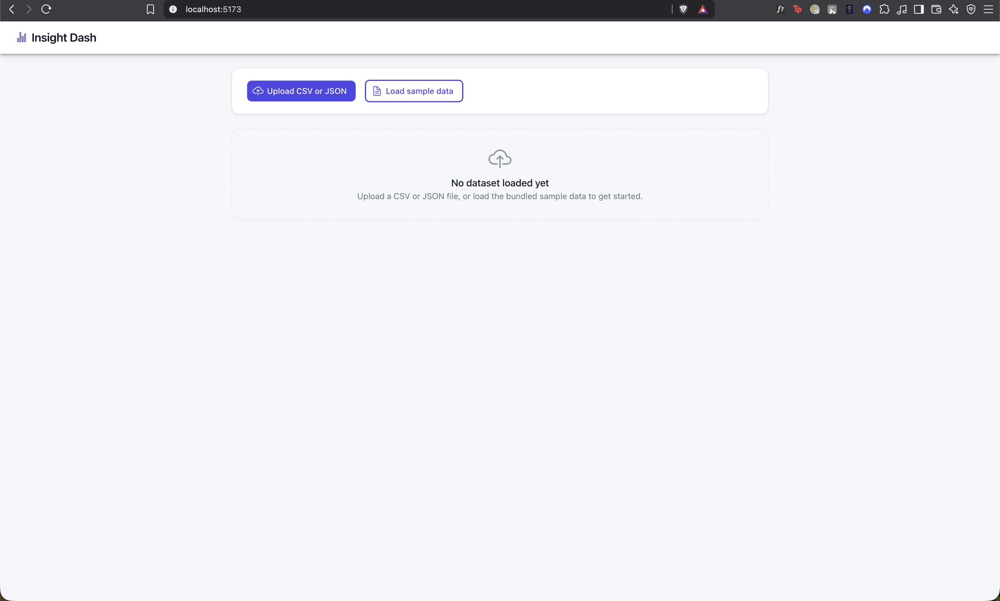
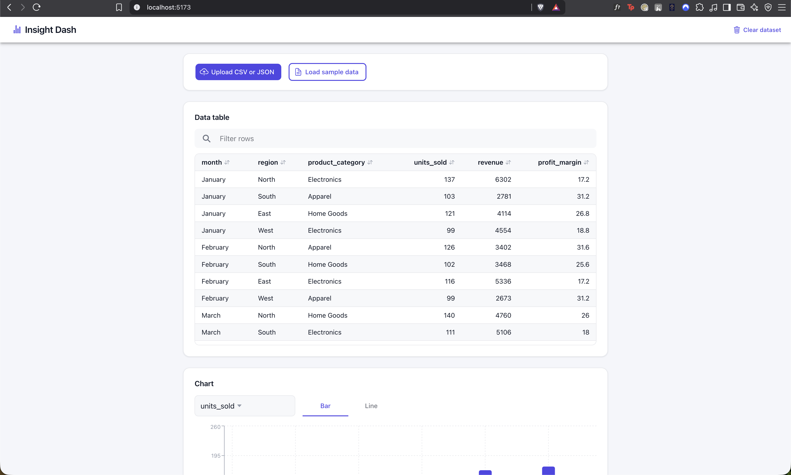
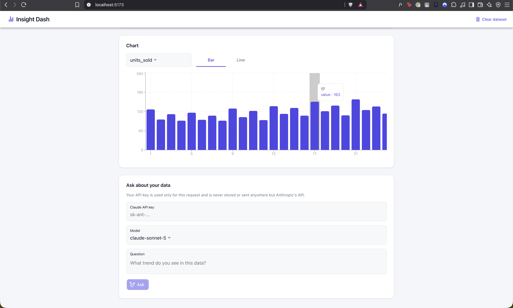
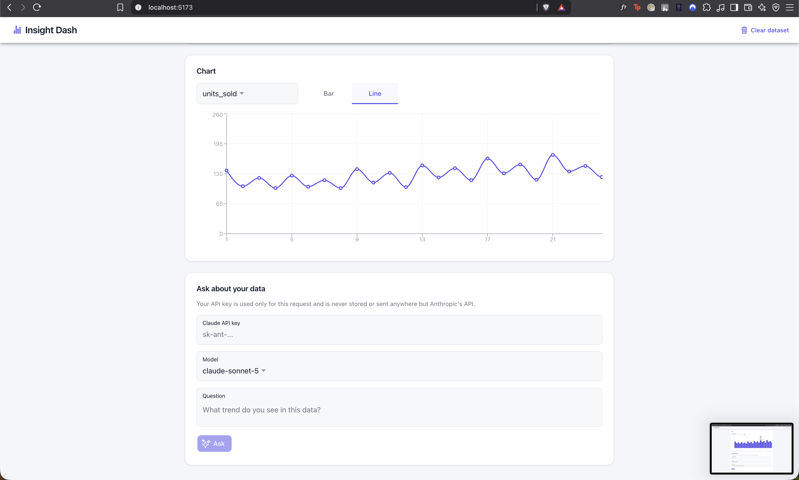
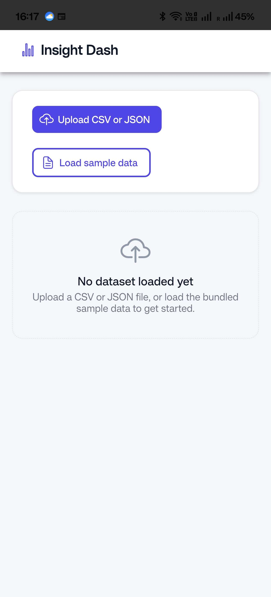
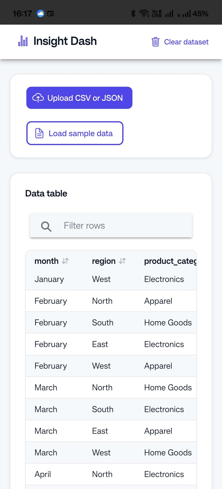
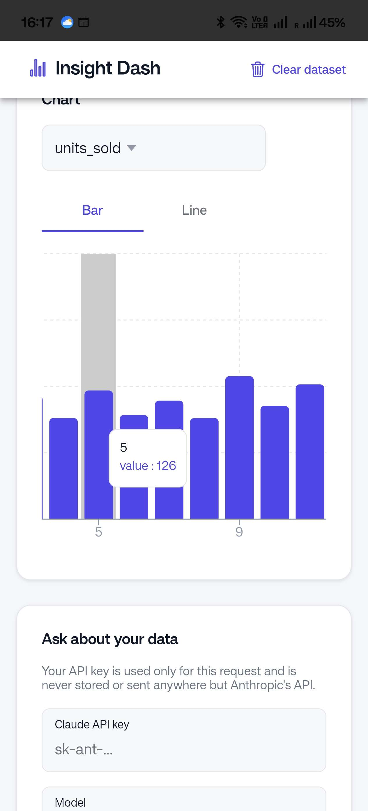
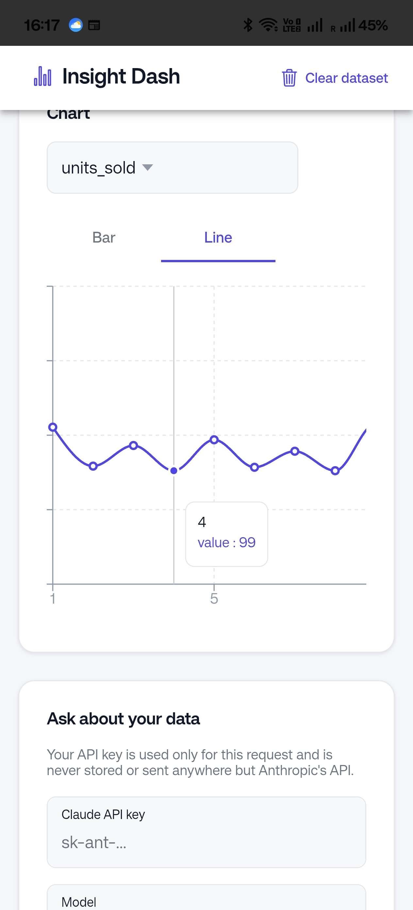

# Insight Dash

A small, standalone data dashboard: upload a CSV or JSON file, explore it in
a sortable and filterable table, chart a numeric column, and optionally ask
a question about the dataset using the Claude API. Everything runs
client-side — there is no backend.

## Features

- **File upload** — CSV or JSON, parsed entirely in the browser.
- **Data table** — click a column header to sort, use the search box to
  filter across all columns.
- **Chart** — pick a numeric column and toggle between a bar or line chart.
- **Ask about your data (optional)** — paste your own Claude API key at
  runtime and ask a question about the loaded dataset. The key is kept only
  in memory for the session; it is never stored or hardcoded.

## Screenshots

|                                    |                                    |
| ---------------------------------- | ---------------------------------- |
|  |  |
| Upload / empty state | Data table, sorted |
|  |  |
| Chart — bar, with tooltip | Chart — line, with tooltip |

On Android (Capacitor debug build):

|                                    |                                    |
| ---------------------------------- | ---------------------------------- |
|  |  |
| Empty state | Data table, sorted |
|  |  |
| Chart — bar, with tooltip | Chart — line, with tooltip |

## Tech stack

- [Vite](https://vitejs.dev/) + React + TypeScript
- [Ionic React](https://ionicframework.com/docs/react) + Ionic React Router
- [Capacitor](https://capacitorjs.com/) (Android)
- [Papa Parse](https://www.papaparse.com/) for CSV parsing
- [Recharts](https://recharts.org/) for charting
- [Vitest](https://vitest.dev/) + React Testing Library for tests

## Running locally

```bash
npm install
npm run dev
```

Open the printed local URL, then click **Load sample data** to try the app
immediately, or upload your own `.csv` or `.json` file.

## Running tests

```bash
npm test
```

## Building for the web

```bash
npm run build
```

Outputs a static bundle to `dist/`, deployable to any static host.

## Building an Android debug APK

This project is Capacitor-ready. To build a debug APK:

```bash
npm run build
npx cap sync android
```

Then either:

- Open the `android/` folder in Android Studio and use **Build > Build APK**, or
- Run `cd android && ./gradlew assembleDebug` and find the APK under
  `android/app/build/outputs/apk/debug/`.

The Android Gradle build requires **JDK 21** (not just any JDK on your
`PATH`) — if `./gradlew` fails with `invalid source release: 21`, point
`JAVA_HOME` at a JDK 21 install for that command, e.g.:

```bash
JAVA_HOME=/path/to/jdk-21 ./gradlew assembleDebug
```

## Using the "Ask about your data" panel

This feature calls the Claude API directly from the browser, so it needs
your own API key (from [console.anthropic.com](https://console.anthropic.com)) pasted into
the password field at runtime. That key is:

- **Never** hardcoded or committed to this repository.
- **Never** persisted to storage — it lives only in component state for the
  current session and is gone on page reload.
- Sent directly from your browser to Anthropic's API using the
  `anthropic-dangerous-direct-browser-access` header, which means it is
  visible in your browser's network requests. That's an acceptable
  tradeoff for a local, single-user tool like this one, but it is **not**
  a pattern to use for a real multi-user product — a production app would
  proxy this call through a backend that holds the key server-side.

## Development approach

This project was built spec-first: a short design document was written and
reviewed before any code, then implemented test-first (a failing test
before each piece of implementation) in small, independently-committed
steps, using AI pair-programming tools throughout for both planning and
implementation. The AI-assisted parts of the workflow — spec review, test
generation, boilerplate — are treated the same way any other tool output
would be: read, checked, and adjusted before being committed, with the
deterministic pieces (parsing correctness, type safety, test coverage)
held to the same bar as if written by hand.

The original design spec and task-by-task implementation plan are kept in
[`docs/specs/`](docs/specs/) and [`docs/plans/`](docs/plans/) for anyone who
wants to see the process behind the commit history.
